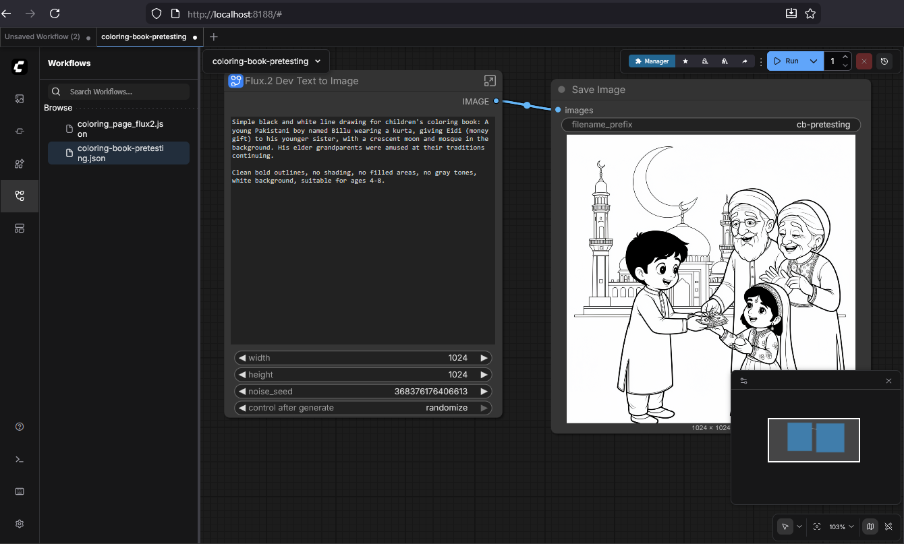
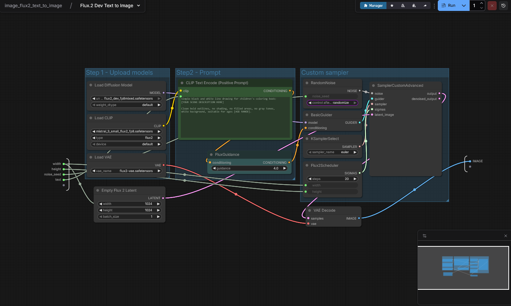

# a-book-for-lily


## Architecture Diagram

```
┌────────────────────────────────────────────────────────────────────────────┐
│                            YOUR LAPTOP (RTX 5090)                          │
│                                                                            │
│  ┌─────────────────────────────────────────────────────────────────────┐  │
│  │                         WSL2 Ubuntu 22.04                            │  │
│  │                                                                      │  │
│  │  ┌────────────────────────────────────────────────────────────────┐ │  │
│  │  │                    coloring-book/a-book-for-lily/                          │ │  │
│  │  │                                                                 │ │  │
│  │  │  src/                                                           │ │  │
│  │  │  ├── core/           # Shared FLUX pipeline                     │ │  │
│  │  │  │   ├── pipeline.py      # Model loading, FP8                  │ │  │
│  │  │  │   ├── generator.py     # Image generation                    │ │  │
│  │  │  │   └── config.py        # Settings                            │ │  │
│  │  │  │                                                              │ │  │
│  │  │  ├── prompts/        # Prompt engineering                       │ │  │
│  │  │  │   ├── templates.py     # Base templates                      │ │  │
│  │  │  │   ├── cultural.py      # Pakistani context                   │ │  │
│  │  │  │   └── styles.py        # Coloring book modifiers             │ │  │
│  │  │  │                                                              │ │  │
│  │  │  └── mcp/            # Claude integration                       │ │  │
│  │  │      └── server.py        # FastMCP server                      │ │  │
│  │  │                                                                 │ │  │
│  │  │  configs/                                                       │ │  │
│  │  │  └── settings.yaml        # Paths, defaults                     │ │  │
│  │  │                                                                 │ │  │
│  │  │  comfyui/                                                       │ │  │
│  │  │  └── workflows/           # Pre-built workflows                 │ │  │
│  │  │      ├── standard.json         # 1024x1024, 20 steps            │ │  │
│  │  │      ├── detailed.json         # 1024x1024, 30 steps            │ │  │
│  │  │      └── pattern.json          # Borders, seamless              │ │  │
│  │  │                                                                 │ │  │
│  │  │  docs/                                                          │ │  │
│  │  │  ├── friend-guide-comfyui.md   # Screenshot walkthrough         │ │  │
│  │  │  ├── friend-guide-claude.md    # MCP setup for friends          │ │  │
│  │  │  └── prompt-examples.md        # Copy-paste templates           │ │  │
│  │  └─────────────────────────────────────────────────────────────────┘ │  │
│  │                                                                      │  │
│  │  ┌─────────────────┐          ┌─────────────────┐                   │  │
│  │  │    ComfyUI      │          │   MCP Server    │                   │  │
│  │  │   Port 8188     │          │   Port 8765     │                   │  │
│  │  │                 │          │                 │                   │  │
│  │  │  Browser UI     │          │  Claude Tools   │                   │  │
│  │  │  for friends    │          │  for friends    │                   │  │
│  │  └────────┬────────┘          └────────┬────────┘                   │  │
│  │           │                            │                            │  │
│  └───────────┼────────────────────────────┼────────────────────────────┘  │
│              │                            │                               │
│              │    ┌───────────────────────┘                               │
│              │    │                                                       │
│              ▼    ▼                                                       │
│         Local Network: 192.168.x.x                                        │
│         (or Tailscale for remote access)                                  │
└────────────────────────────────────────────────────────────────────────────┘
                              │
          ┌───────────────────┼───────────────────┐
          │                   │                   │
          ▼                   ▼                   ▼
    ┌──────────┐        ┌──────────┐        ┌──────────┐
    │ Friend A │        │ Friend B │        │   You    │
    │ Browser  │        │ Claude   │        │  Either  │
    │ ComfyUI  │        │ Desktop  │        │   Path   │
    └──────────┘        └──────────┘        └──────────┘
```


---

## Setup Dependencies
 - Image Generation Model: Flux 2.Dev (FP8, and F16)
 - CUDA 12.8
 - RTX 5090 24GB VRAM

## Potential Options and Use Cases:
- SaaS Offering: Replicate (pay .3 per image, or they publish all free images)
    - For one coloring book for one end user, it's probably better to use this SaaS.
    - If we wanted to abstract and create a ton of images for custom books. Imagine we take a simple image of the family the user gives us, and add that our workflow to generate a new book with their images. 
    - We get better free testing to hone our prompts and seed context until we are ready to pay
    - We get to keep all our data / prompts. We can freely use ourselves without "giving our image data away". 
- The key is to learn that we can build out our own workflows using offline, local models. It doesn't have to be image generation.
- The abstract approach above is a cool idea. We should be able to take requests from people, and generate the same type of coloring book with their uploaded features or requests. 

## Value Additions
- In the architectural diagram, the prompts folder with pre-seeded detailed prompts are going to be valuable.
- Adding an MCP Server and using Claude / Chat-GPT will mean instead of having a detailed prompt direclty inside the Flux-2 node, Claude can help prompt inject / prompt surgery and help the user use natural language. For example, currently, we have to provide all the details inside the Flux 2 prompt like what is Eid, Frontier LLMs like Claude would help inject a ton of extra detail around those simple words. Or we could do that ourselves inside a script or manually have a larger prompt that we can copy into the Flux 2 node with details.

## Timeline Summary

| Day | Phase | Tasks |
|-----|-------|-------|
| 1 | Environment | WSL2, CUDA, Python, Miniconda |
| 1-2 | ComfyUI | Install, download models, custom nodes |
| 2 | Workflows | Create and test 3 workflow templates |
| 2-3 | Documentation | Friend guides, prompt examples |
| 3-4 | MCP Server | Core modules, prompt engineering, server |
| 4 | Networking | Firewall, port forwarding, (Tailscale) |
| 5 | Testing | End-to-end tests, friend access tests |

**Total estimated time: 5 days of focused work**

## Success Logs

```
[ComfyUI-Manager] All startup tasks have been completed.
got prompt
Using xformers attention in VAE
Using xformers attention in VAE
VAE load device: cuda:0, offload device: cpu, dtype: torch.bfloat16
Found quantization metadata version 1
Using MixedPrecisionOps for text encoder
CLIP/text encoder model load device: cuda:0, offload device: cpu, current: cpu, dtype: torch.float16
Requested to load Flux2TEModel_
loaded completely; 21815.80 MB usable, 17180.60 MB loaded, full load: True
Found quantization metadata version 1
Detected mixed precision quantization
Using mixed precision operations
model weight dtype torch.bfloat16, manual cast: torch.bfloat16
model_type FLUX
Requested to load Flux2
loaded partially; 20159.57 MB usable, 19296.00 MB loaded, 14517.00 MB offloaded, 1296.00 MB buffer reserved, lowvram patches: 0
100%|██████████████████████████████████████████████████████████████████████████████████████████| 20/20 [01:17<00:00,  3.88s/it]
Requested to load AutoencoderKL
Unloaded partially: 1368.00 MB freed, 17928.00 MB remains loaded, 1296.00 MB buffer reserved, lowvram patches: 0
loaded completely; 269.87 MB usable, 160.31 MB loaded, full load: True
Prompt executed in 139.18 seconds
```

TODO:
- TailScale for friend access
- Documentation
- MCP Server